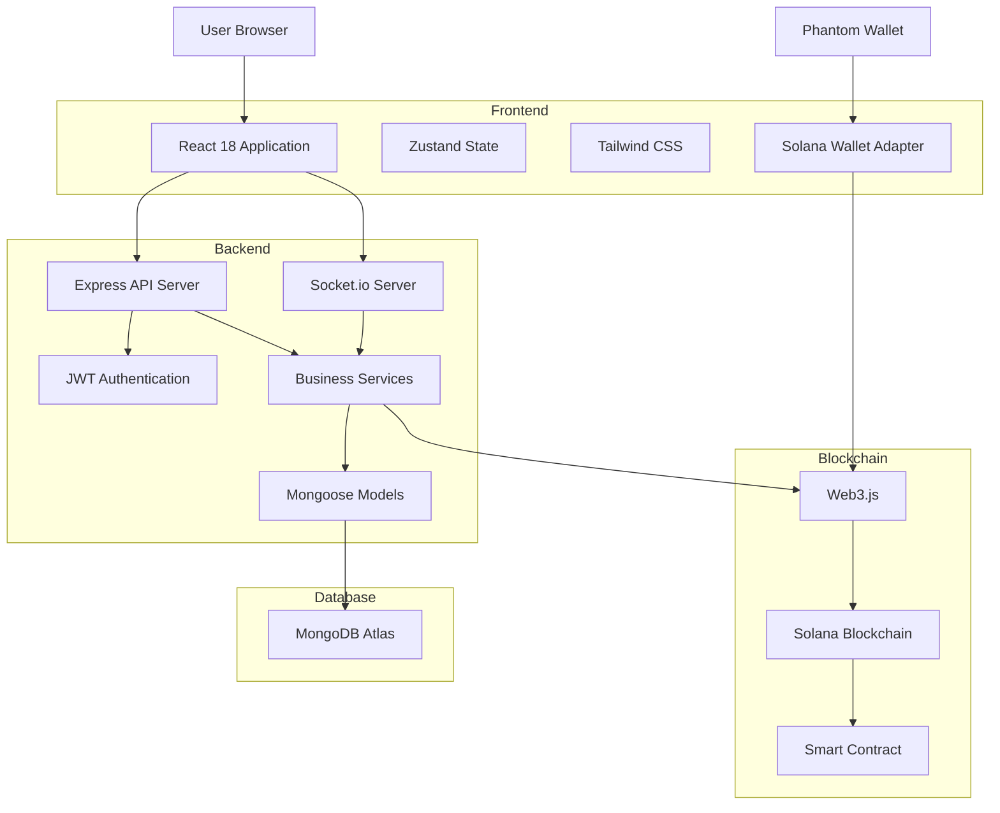

# LucidDrop Architecture

**Last Updated:** 2026-07-03

## Overview

LucidDrop is a full-stack Solana casino platform with a modern web architecture. The system follows a layered architecture pattern with clear separation of concerns between frontend, backend, blockchain, and database layers.

## System Architecture

## Architecture Layers

### 1. Frontend Layer

**Technology:** React 18 with Tailwind CSS and Zustand

**Components:**
- **UI Components**: Reusable React components (CasinoSlots, DegenCrash, CoinFlip, etc.)
- **State Management**: Zustand for global state
- **Styling**: Tailwind CSS for responsive design
- **Wallet Integration**: Solana Wallet Adapter for Phantom wallet
- **Real-time Updates**: Socket.io client for WebSocket communication

**Key Directories:**
- `frontend/src/components/` - UI components
- `frontend/src/store/` - Zustand stores
- `frontend/src/services/` - API services
- `frontend/src/hooks/` - Custom React hooks

### 2. Backend Layer

**Technology:** Node.js with Express and Socket.io

**Components:**
- **API Server**: Express.js REST API
- **WebSocket Server**: Socket.io for real-time communication
- **Authentication**: JWT with wallet signature verification
- **Services**: Business logic services (bonus, solana, withdrawal)
- **Models**: Mongoose ODM for database operations

**Key Files:**
- `backend/src/index.js` - Entry point
- `backend/src/routes/` - API routes
- `backend/src/services/` - Business services
- `backend/src/models/` - Mongoose models

### 3. Database Layer

**Technology:** MongoDB Atlas

**Models:**
- **User**: User accounts and authentication
- **Bet**: Game bets and history
- **Transaction**: Financial transactions
- **Session**: User sessions

**Key Files:**
- `backend/src/models/User.js`
- `backend/src/models/Bet.js`
- `backend/src/models/Transaction.js`
- `backend/src/models/Session.js`

### 4. Blockchain Layer

**Technology:** Solana with Web3.js

**Components:**
- **Wallet Integration**: Phantom wallet support
- **Transaction Processing**: SOL transfers and smart contract interactions
- **Stealth Wallet**: Private key management
- **Event Listening**: Blockchain event monitoring

**Key Files:**
- `backend/src/services/solana.js` - Main Solana service
- `backend/src/services/solanaListener.js` - Event listener
- `backend/src/services/solanaStealth.js` - Stealth wallet
- `smart-contract/contracts/LucidDrop.sol` - Smart contract

## Data Flow

### User Betting Flow

1. User connects Phantom wallet via frontend
2. Frontend authenticates with backend using wallet signature
3. User places a bet (Crash, Slots, or Coin Flip)
4. Backend validates bet, checks balance, and processes game logic
5. Game result is determined using provably fair system
6. Result is broadcast via Socket.io to all connected clients
7. Transaction is recorded on Solana blockchain
8. Bet history and transactions are stored in MongoDB

### Deposit Flow

1. User initiates deposit via frontend
2. Frontend requests deposit address from backend
3. Backend generates unique deposit address using stealth wallet
4. User sends SOL to the deposit address
5. SolanaListener detects incoming transaction
6. Backend credits user's balance in database
7. User receives notification via Socket.io

### Withdrawal Flow

1. User initiates withdrawal via frontend
2. Backend validates withdrawal request
3. Backend processes withdrawal via Solana service
4. Transaction is sent to Solana blockchain
5. Withdrawal is recorded in database
6. User receives confirmation via Socket.io

## Security Architecture

### Authentication
- Wallet signature verification using tweetnacl
- JWT tokens for session management
- Rate limiting on all API endpoints

### Data Security
- All sensitive data encrypted at rest
- Environment variables for secrets
- MongoDB Atlas with security features

### Blockchain Security
- Private keys stored in casino-wallet.json (encrypted)
- Stealth wallet implementation for deposits
- Transaction validation and verification

## Real-time Architecture

### WebSocket Events
- `join`: User joins their room for personal updates
- `game:update`: Real-time game state updates
- `game:result`: Game result notifications
- `chat:message`: Live chat messages
- `leaderboard:update`: Leaderboard updates

### Socket.io Configuration
- Room-based event broadcasting
- Automatic reconnection
- Event-driven communication

## Deployment Architecture

### Docker Setup
- Frontend container (React)
- Backend container (Node.js/Express)
- Nginx proxy for routing

### Environment Configuration
- Development: docker-compose.yml
- Production: docker-compose.prod.yml
- Deployment script: deploy.sh

## Performance Considerations

### Optimization Points
- Database query optimization
- Frontend bundle optimization
- WebSocket connection pooling
- Caching strategy (planned)

### Scaling Strategy
- Horizontal scaling for backend
- MongoDB Atlas auto-scaling
- Load balancing for WebSocket connections

---
*Generated by LucidDrop AI OS Phase 2*
